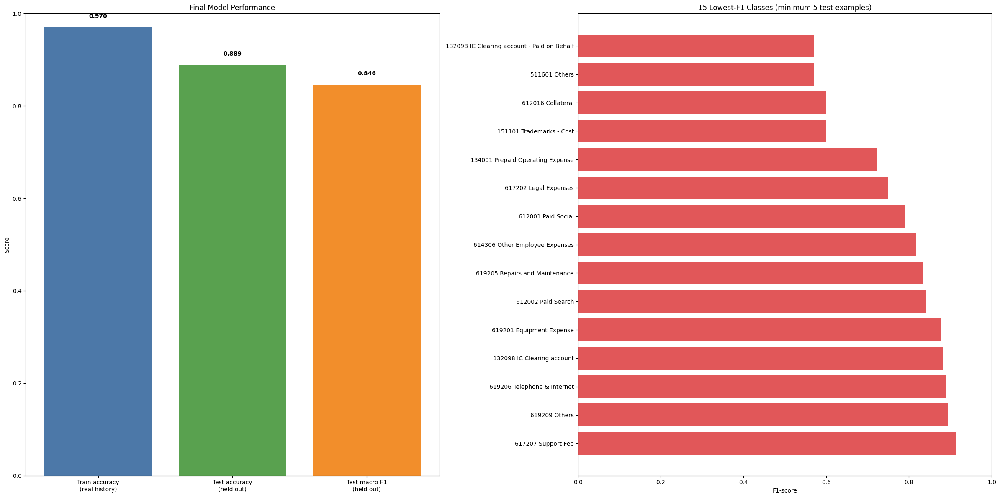
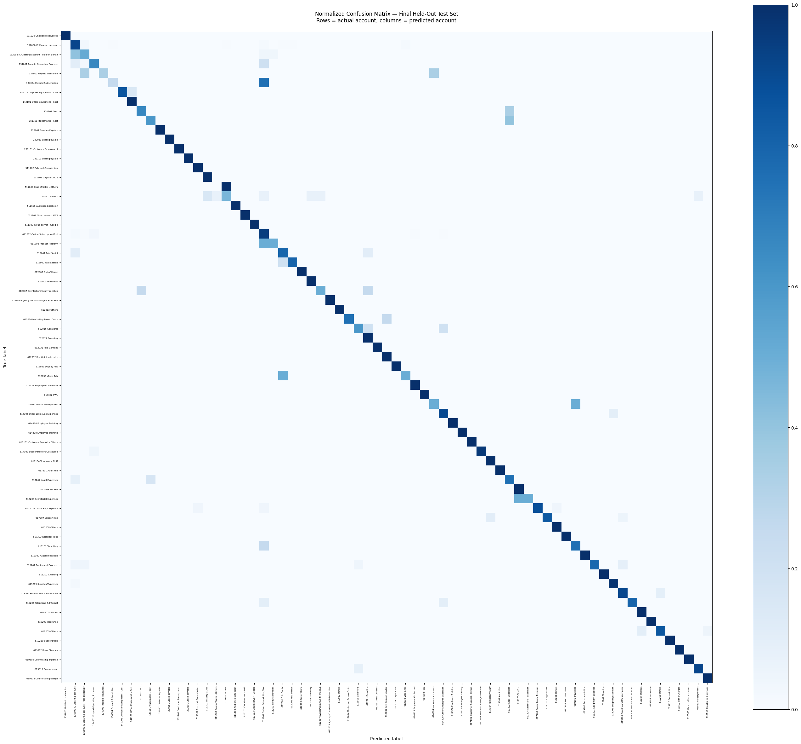

# Peakflo Account Classifier

This project predicts the `accountName` for expense transactions using vendor history and invoice text. The goal is not to replace finance review for every transaction; it is to automate the common, well-supported cases and flag categories with too little historical evidence.

The final model is a TF–IDF + LinearSVC classifier with a conservative vendor fallback. It achieved **88.92% accuracy** and **84.64% macro F1** on a held-out set of real transactions, exceeding the 85% target in the assignment.

## Final result

- Held-out accuracy: **88.92%**
- Held-out macro F1: **84.64%**
- Real-history training accuracy: **97.05%**
- Train–test gap: **8.12 percentage points**
- Safe vendor-rule coverage: **33.9%** of the held-out test set



The score applies to 69 account categories with at least five real examples. Those categories cover 4,826 of 4,894 real transactions (98.6%). The remaining 34 rare categories are routed to manual review because the available history is not sufficient for stable automated evaluation.

## Approach

### Data preparation

- Remove newline and tab artefacts from `itemName`.
- Remove leading billing-period prefixes such as `0126` or `1225-0227`.
- Fill missing `itemDescription` values from the cleaned item name.
- Merge cleaned item name and description into `merged_iName_iDesc`.
- Drop `_id` and `accountId`; both are identifiers, and `accountId` would leak the target.

The notebook explores a log transformation of transaction amounts because the raw amount distribution contains substantial outliers. The final selected model is text-first and does not use the amount feature without validation evidence that it improves generalisation.

### Validation design

Only real transactions are used for validation and final testing.

- 60% real data: training
- 20% real data: validation and model selection
- 20% real data: final held-out test
- Synthetic rows: training only

The model compares three `C` values for `LinearSVC` on the validation partition, selects the strongest setting by macro F1, then refits on all non-test data before evaluating once on the held-out test set.

### Features and model

The model uses TF–IDF word unigrams and bigrams. `vendorId` is included as a categorical token, for example `__vendor_abc123`, instead of being label-encoded as an arbitrary number. This avoids introducing false numeric relationships between unrelated vendors.

After the text model predicts an account, a fallback rule is applied only when a vendor has at least three real historical examples and every one of those examples maps to the same account. The fallback is built from training history only; validation and test labels are never used to create it.

## Error analysis

The model is strongest on frequent, consistently described accounts such as Online Subscription/Tool, Employee On Record, Supplies/Expenses, and Courier and postage. The harder cases are semantically similar account subcategories and categories with very little support.

The confusion matrix below is normalised by actual class. Read each row as the true account and each column as the predicted account. A strong result concentrates colour along the diagonal.



Per-class values based on one to three test examples should be treated cautiously. A single error can materially change precision, recall, or F1 for those categories.

## Repository contents

- `submission.ipynb` — end-to-end analysis, model selection, evaluation, and visualisations.
- `data/augmented_dataset.csv` — local working input used by the notebook. It is excluded from Git because transaction data may be sensitive.
- `README_assets/` — images used in this README.

## Run locally

Use Python 3.10+ and install the required packages:

```bash
python -m pip install pandas numpy scikit-learn matplotlib
```

For the downloader, set a fresh private source URL in `PEAKFLO_SOURCE_URL`; do not commit that URL. Open `submission.ipynb`, confirm that `dataset_File_path` points to `data/augmented_dataset.csv`, then run the notebook from top to bottom. Random seeds are fixed at `42` for reproducibility.

## Limitations and next steps

- The random held-out split contains many repeat vendors and recurring invoice descriptions. It is useful for estimating performance on ongoing operations but may be optimistic for unseen vendors.
- The rarest account categories are deliberately not automated. Their review rate should be tracked alongside accuracy in production.
- The synthetic-data generation process should be included with the submission, or the augmented CSV should be supplied, so another reviewer can reproduce the result.
- With more time, I would add repeated stratified cross-validation, vendor-grouped evaluation for cold-start vendors, confidence calibration for review routing, and character n-grams for noisier descriptions.

## Submission notes

The model meets the required 85% accuracy threshold. It does not claim to exceed the optional 92% benchmark. The recommended use case is finance decision support with a manual-review path for rare, ambiguous, or insufficiently supported categories.
